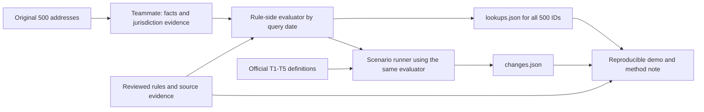

# Submission Readiness and Integration Plan

Review date: **2026-10-03**. Default legal query date: **2026-10-01**.

This plan describes the current Module A snapshot and the remaining integration work. The teammate will assemble and submit the final competition package; the address-facts role supplies factual inputs and does **not** imply responsibility for implementing lookups. Our rule/integration side must consume those facts, evaluate rules, and produce the lookup/change files. Unshared teammate work is not included in the readiness assessment. No Module B/C implementation, geocoding, extraction rerun or address applicability decision was performed during this review.

The handed-off [rules.json](outputs/module_a/rules.json) contains **466 records** with SHA-256 `8430e5972ec27ef3c490f40bdf54b0bf1775b65371f850d4170e18b4b71140e9`. Use this hash, the query date, and the original address IDs to identify the integration inputs. The final-submission role does not change the limited first-pass address contract below.

## What the competition requires

The [six-page participant PDF](participant-final-no-hour16_v5/mit-rental-housing-law-navigator-challenge-v5-participant-no-scoring-no-hour16.pdf), especially pages 2 and 6, requires Modules A/B/C and a package containing:

| Deliverable | Required content | Current local status |
| --- | --- | --- |
| `rules.json` | Structured, automatically extracted rules with citations and supporting source text | 466 reviewed records exist; source and reproducibility gaps remain |
| `lookups.json` | Results for every supplied address, identified by `address_id`, with rule IDs, result, explanation and conflict flag | No non-template output or evaluator found |
| `changes.json` | Affected-address sets and conflict reporting for T1–T5 | No non-template output or scenario runner found |
| Live demo | Reproducible extraction and end-to-end workflow | Extraction code exists; historical local caches are not included in the public handoff, and the current 466-record path needs a documented reproducible workflow |
| One-page method note | Method, sources, date handling, gaps and limitations | Existing technical/audit documentation does not yet form this final note |

The organizer [README](participant-final-no-hour16_v5/README.md) prioritizes **A+B** as the minimum viable submission if time is short; the full target remains A+B+C. `lookups` must contain every one of the **500** original address IDs, including unresolved cases. This is not a requirement to return all 466 rules for every address or to label every result `applies`.

The current `{"rules": [...]}` wrapper follows the official submission template even though the README uses the phrase "a list". Preserve the working format unless the organizer clarifies otherwise. The individual rule schema does not validate the entire submission package.

## What the address CSV actually supplies

The [original CSV](participant-final-no-hour16_v5/data/sample_addresses.csv) has 500 unique IDs and 11 columns:

`address_id`, `street_address`, `postal_city`, `state`, `zip`, `year_built`, `units`, `use_code`, `use_description`, `source_dataset`, `retrieved_at`.

| Field / combination | Present | Missing |
| --- | ---: | ---: |
| Address ID, street, postal city, state | 500 | 0 |
| ZIP | 370 | 130 |
| Construction year | 288 | 212 |
| Numeric unit count | 258 | 242 |
| Use code and description | 500 | 0 |
| Both construction year and numeric unit count | 203 | 297 lack at least one |

There are 85 year-only records, 55 unit-only records and 157 with neither field. These are **field-completeness counts**, not numbers of addresses whose legal coverage can be decided. Even the 203 rows with both fields lack owner facts, CO dates and verified jurisdiction. Conversely, a missing field need not prevent a rule whose outcome does not depend on it.

| Organizer sample group, not verified jurisdiction | Addresses | Missing year | Missing units |
| --- | ---: | ---: | ---: |
| Los Angeles | 80 | 6 | 3 |
| San Francisco | 80 | 2 | 0 |
| San Diego | 50 | 50 | 0 |
| Berkeley | 40 | 40 | 40 |
| Jersey City | 50 | 22 | 50 |
| Hoboken | 40 | 36 | 39 |
| Newark | 50 | 48 | 50 |
| Boston | 60 | 8 | 60 |
| Cambridge | 50 | 0 | 0 |

Declared states are CA 250, NJ 140 and MA 110. Santa Ana has rules in the corpus but **no sample addresses**; do not add synthetic Santa Ana rows or delete its extraction records for that reason.

The data is enough to start jurisdiction resolution and evidence-based candidate selection. It is not enough to make every rule decision conclusive. The organizer deliberately omits owner names and accepts `unknown`. Use descriptions sometimes provide useful bounds, but dataset definitions and conflicting values must be checked. See the [address profile](outputs/submission_readiness_20261003/address_profile.json) for all counts and anomalies.

## Where the rule data is ready, and where it is not

- All **466 records** have citation, URL, exact supporting text, and an `applicability` extension. The reviewed data includes **2,186 criteria** and **541 context-bound fact keys**. The fact catalog is not a request to ask every user 541 questions.
- The applicability contract explicitly says the logic is **source-backed natural language, not executable predicates**. All 466 records remain unevaluated for a particular property. There is no local address-to-rule decision engine.
- Current statuses are **457 `in_force`, 6 `not_yet_effective`, 2 `pending` and 1 `failed`**, all assessed at 2026-10-01. Status must be recalculated appropriately for a different test date; **326 null effective-date fields** cannot be filled by guessing. The current external review records 102 dated confirmations, 333 externally supported records, 30 corpus-only records and one source conflict; these are evidence qualifications, not property applicability decisions.
- Only 10 records are labeled `property_rule`; 253 are event rules, 110 transaction rules, 63 party-conduct rules, 27 government/court duties and 3 proposal/status records. These labels are routing aids, not a claim that only 10 rules belong in an address answer. Address coverage, conditional duties, current triggers and actual violations must be distinguished.
- The local research workspace has text for **60 of 87 manifest entries**: 54 organizer snapshots and six supplemental captures; 27 have no local text. The earlier extraction/recovery stages processed 59 sources. The subsequent status review incorporated official final San Diego source D074 into three existing records, without a broad extraction rerun. There are no extracted Newark-local records, one Hoboken-local record and four Jersey City-local records. NJ statewide rules still exist, but an empty local inventory is not proof that no local law applies.
- **282 records** have source questions concerning at least one branch. Resolve only the question relevant to a selected result; do not reject the entire record or silently ignore the uncertainty.
- A historical citation audit classified 194 records as guidance-only; it predates the external status review and is not a current source-authority count. Government guidance is not automatically disqualified by the competition requirements. Prioritize substantive support, missing coverage and test-critical dates instead of requiring a primary-statute replacement for every government guide.
- The original cached extraction command reproduced the historical 340-record output. The current 466 records and applicability extensions involve separate recovery, merge and review stages. A current end-to-end replay has not been demonstrated.

Current handoff references: [applicability contract](outputs/module_a/applicability_contract.json), [fact catalog](outputs/module_a/applicability_fact_catalog.json), [format/provenance validation](outputs/module_a/format_validation.json), and [status review report](outputs/module_a/status_verification_report.json). Historical extraction, citation, replay and applicability audit artifacts remain local and are not included as current validation reports in the minimal handoff.

### Public handoff and source-validation boundary

The public package includes the unchanged organizer pack and [official supplemental D074](data/supplemental/D074.txt): **55 local source texts**, not all 60 local research captures. It omits third-party full-text supplements and model caches. D037 (Morgan Lewis, six primary rule records) and D059 (WBUR, one primary record) are still needed, alongside D074, to repeat exact quotation validation for the complete export. D035, D086 and D087 are historical research captures not referenced by the current rules.

The shipped validation report records the successful check against the complete local evidence set. A public clone without D037/D059 cannot independently repeat that full check. Fetching a newer page may change its text, offsets and capture metadata; it is not automatically the same evidence snapshot. Source URLs and status-review evidence remain in the rule records, but they do not replace missing original captures for exact quotation checks. This boundary must be reflected in the method note and demo rather than presented as a fully reproducible public clone.

## The missing connection

The teammate supplies evidence-backed inputs. The evaluator must choose relevant jurisdictions and legal versions, bind facts to the correct unit/owner/event, evaluate AND/OR/exception branches, resolve applicable precedence, and explain the result. Comparing city strings or counting matched keywords is insufficient.

Agree on **address-coverage mode** first: report the applicable protection and its conditional duty without pretending that a screening fee was charged, a tenant moved out, a landlord violated the rule, or damages are owed. Event-specific branches must retain their conditions. Absence of every possible litigation/event fact should not make every general property protection unknown. Conversely, unknown facts that determine coverage or an exclusion cannot be ignored.

## Fact priorities for the teammate

The exact minimum return and optional later files are defined in [ADDRESS_FACT_HANDOFF.md](ADDRESS_FACT_HANDOFF.md). Send that document and the unchanged [address CSV](participant-final-no-hour16_v5/data/sample_addresses.csv) to start; the [address profile](outputs/submission_readiness_20261003/address_profile.json) is an optional aid. The full rules and fact catalog are technical references for our side, not a research checklist for the address teammate.

1. **One traceable return covering all 500 IDs:** make a reasonable bulk jurisdiction pass; return established state and municipality/unincorporated status, or explicit partial/unknown/conflicting results with reasons. Include county when the same lookup provides it; no separate county search is required for the first pass. Postal labels and ZIPs do not establish city boundaries.
2. **Reuse the original property observations:** join year, units, use codes/descriptions and provenance by `address_id`. Do not retype them, re-research every populated value, or treat every blank as a manual lookup task. Keep conflicting fields visible and any derived unit range tied to its source definition and counting scope.
3. **Make only inexpensive additions:** retain facts returned by the same bulk source or already collected. New facts need source references and retrieval dates; preserve observation/effective dates and precision when known. Coordinates, APNs, ZIP completion, CO dates, owner and program investigations are not mandatory minimum fields.
4. **Return first, then ask targeted questions:** our side identifies a still-relevant missing fact, its address/rule IDs, scope/date and potential effect before requesting deeper research. Expensive CO, owner, program, title or property-history work remains deferred; an unknown exemption is not thereby false.

The first pass is complete after the bulk attempt and a traceable return for all IDs, including unresolved cases. It need not make every rule conclusive. Do not postpone integration until all facts are known or require the teammate to implement the evaluator.

## Result adapter to agree before implementation

The existing applicability review uses internal states; the official lookup format uses `applies`, `unknown`, `superseded`, `not_yet_effective`, and `pending`.

| Internal decision / legal state | Submission treatment |
| --- | --- |
| Coverage established for an in-force rule | `applies`, with the relevant conditions and evidence in the explanation; not a violation finding |
| Required fact missing | `unknown`, naming the missing fact and why it matters |
| Material source/definition ambiguity | Keep internal source-review status; avoid a conclusive `applies`; if surfaced as `unknown`, explain legal-source uncertainty distinctly from missing property facts |
| Covered but displaced by a governing stricter rule | `superseded`, with a rule-specific and address-specific explanation; not a global deletion of the state rule |
| Enacted but future operative date | `not_yet_effective`, based on the requested date and correct branch |
| Pending proposal | `pending`; hypothetical effect is separate from a present obligation |
| Known noncoverage | Omit that rule from the lookup array; keep the reason in the audit trail |
| Failed proposal | Retain `failed` in Module A; never return it as an applicable lookup rule; T5 affected set remains empty |

Every original ID must remain a key in `lookups`, even if its final array is empty. An empty array is not a substitute for explaining unresolved coverage or incomplete source coverage. Keep richer reasoning/evidence sidecars if the submission template does not carry every internal field.

## Test-specific readiness

These are planning findings, **not executed tests or computed affected-address sets**. Organizer semantic aliases must be mapped to our hashed IDs from documented citations and jurisdictions; do not invent rules to fill an alias.

| Test | Existing support | Remaining work |
| --- | --- | --- |
| T1: CA AB 325 / SB 763 | Both AB 325 records now have the verified effective date **2026-01-01**, with official current BPC section 16729 evidence in `status_verification` | Implement the 2025-12-31 versus 2026-01-02 comparison. No standalone SB 763 record/local text was identified in this export; establish its precise legal relationship and test mapping rather than inventing a separate provision or treating AB 325's timing as unresolved |
| T2: Hoboken versus Jersey City | Both city records retain D037 as their primary captured source, with new official support in `status_verification`: Hoboken section 158-2/Ordinance B-781 and Jersey City adopted Ordinances 25-057/25-076 | Resolve actual city boundaries and any remaining scope needed for the scenario. Preserve month-level onset where exact commencement is unverified; do not substitute adoption dates. Ensure Newark never receives either city's rule merely because it is in NJ |
| T3: NJ FAIR Act | Five records have the documented 2027-07-01 operative date | Recompute status for 2027-07-02 and produce address-specific possible conflicts with the two local laws; do not treat possible preemption as settled invalidation |
| T4: MA pending bills | Two pending bill-status records exist | Map aliases, preserve pending status and produce the hypothetical affected set; status pages do not justify inventing bill provisions |
| T5: Failed MA ballot question | The failed record now identifies Initiative Petition 25-21 and Cella v. Attorney General, SJC-13893, with dated court-opinion evidence from 2026-06-23 | Map the organizer alias to this documented identity, return an empty affected set and no general rent cap; retain unrelated MA rent procedures, antiretaliation and housing-program rules |

Use the organizer's [change-test definitions](participant-final-no-hour16_v5/dev/change_tests.json) and current rule citations/status evidence for explicit alias mapping. Historical local planning notes are not a scenario runner or computed test result. State/group counts are useful sanity checks, not prefilled legal answers or a substitute for address resolution.

## Work sequence and ownership

| Priority | Owner | Concrete next deliverable | Completion evidence |
| --- | --- | --- | --- |
| P0: Freeze inputs and agree handoff | Both sides | Versioned rule snapshot, original 500-ID set and fact/evidence format | Matching hashes and IDs; no edits to organizer pack; small fact sample accepted |
| P0: Close the evaluation gap | Rule/evaluation side | Branch-aware address-coverage evaluation plus official result adapter | Reviewed representative addresses demonstrate known coverage, decisive noncoverage, relevant unknowns and source conflicts |
| P0: Pilot integration | Both sides | A small mixed sample spanning states, postal labels, missing fields and conflicting facts | Evidence traces can explain each decision without inventing values or current tenant events |
| P1: Produce the full lookup set | Rule/evaluation side, consuming teammate facts | `lookups.json` with all 500 IDs | ID completeness, valid rule references/status values, specific unknown reasons, and preserved date/source lineage |
| P1: Fill high-impact source gaps in parallel | Rule/source side | Test-critical dates/local scopes and unresolved coverage needed for selected branches | Targeted evidence-backed updates; retain successful prior work and audit changes |
| P1: Run T1–T5 | Rule/evaluation side | `changes.json` from the same evaluator and explicit scenario runner | Boundary, date, pending, conflict and negative-case assertions pass; no fabricated affected sets |
| P2: Make the current result reproducible | Rule/pipeline side | Documented workflow including recovery, merge, review and evaluation | A replay of the intended submission snapshot or an explicitly bounded demonstrated workflow; original `extract` is not claimed to reproduce unsupported stages |
| P2: Submission packaging | Teammate as primary submitter, with rule/integration support | Three JSON files, one-page method note and live demo | Organizer-format checks, all IDs/tests, traceable citations, dates, source-access/replay limitations and required interface notice |

Priority source work includes missing Newark/Hoboken local material (Newark D070–D072; Hoboken D032–D034), any still-needed SB 763 relationship or local algorithmic scope, and known substantive source-support questions. The AB 325 effective-date gap and D074 final-code gap have been addressed. Not all 27 entries without local research text require equal priority: some mirror statutes already present, while missing local coverage can materially change address answers. Public-package omissions are a separate access/reproducibility issue, not 32 newly unprocessed legal sources. Preserve the organizer corpus and capture supplements separately under permitted access terms.

If changes to models, extraction prompts or schemas are proposed, benchmark representative sources before scaling. For a new evaluator, check representative known/unknown/conflicting cases before evaluating all 500; do not rerun unrelated successful extraction work as part of integration.

## Submission acceptance checkpoints

1. `rules.json` preserves supported rules, source identity, query-date semantics and the required fields; meaningful citation/support gaps are handled visibly.
2. `lookups` contains exactly the supplied 500 IDs; every reported rule ID exists in the submitted rules; unsupported certainty is not used to reduce unknown counts.
3. Jurisdiction and counting/date meanings are traceable. In particular, construction year is not silently a CO date, and portfolio units are not building units.
4. Conditional legal duties, live event facts, penalties and government duties are not indiscriminately attached as current landlord obligations.
5. All five change tests are represented; before/after status and possible-conflict outcomes come from the same version-aware rule data/evaluator.
6. No pending or failed proposal is presented as a current rent cap; the negative MA case does not erase unrelated tenant protections.
7. The demo and method note accurately describe which stages are automated/replayable and what source/property facts remain unresolved.

This review provides no percentage-complete estimate and no count of rules applicable to any address. The measured gap is concrete: a reviewed rule inventory exists, the original fact table is incomplete by design, and the fact-to-rule evaluation and final B/C output path remain to be integrated in this checkout.
